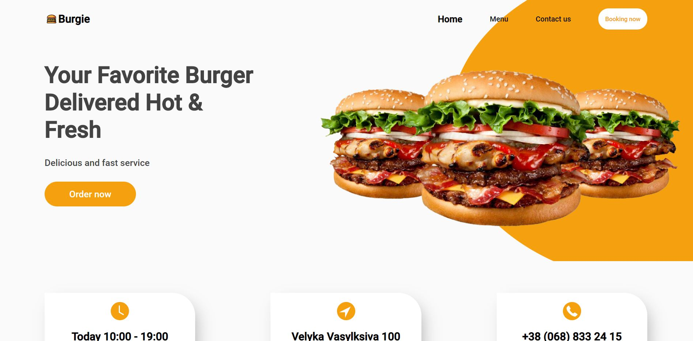

# Restaurant Page

> Javascript application using ES6 and webpack. In this app you use what you’ve learned and take a chance to continue practicing DOM manipulation by dynamically rendering a simple restaurant homepage. By the end, you are going to be using JavaScript alone to generate the entire contents of the website.

## Built With

- JS
- HTML
- CSS

## Preview

## Live Demo

[Live Demo Version](https://raw.githack.com/bren2102/Restaurant-page/feature/dist/index.html)

## Author

👤 **Brenda Yucra**

- Github: [@bren2102](https://github.com/bren2102) 
- Twitter: [@BrendaYucra2](https://twitter.com/BrendaYucra)
- Linkedin: [Brenda Yucra](https://www.linkedin.com/in/brenda-yucra-51980681/)

## Credits

Work based on this [this](https://www.behance.net/gallery/96647171/Foodie-Landing-Page?tracking_source=search_projects_recommended%7Crestaurant%20page) design.

## 🤝 Contributing

Contributions, issues and feature requests are welcome!

Feel free to check the [issues page](issues/).

## Show your support

Give a ⭐️ if you like this project!
